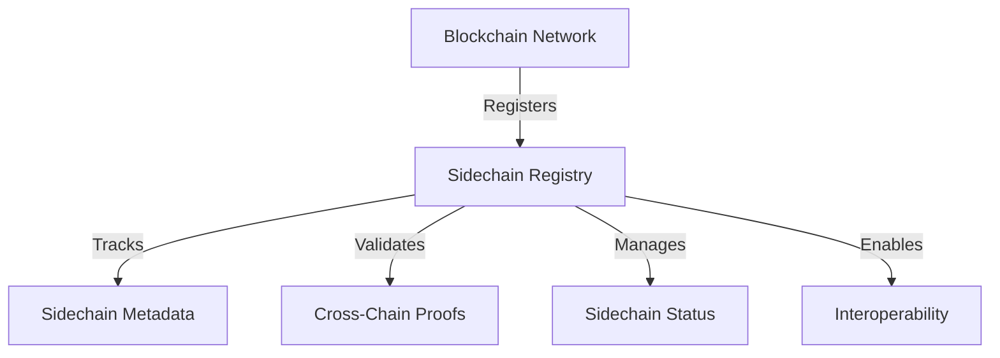

# Parallel Sidechain Container

A sophisticated blockchain infrastructure for managing cross-chain interactions, sidechain registrations, and interoperability across decentralized networks.

## Overview

The Parallel Sidechain Container provides a robust framework for registering, tracking, and validating parallel sidechains. This system enables secure cross-chain communication, verification, and management of distributed blockchain ecosystems.

### Key Features
- Decentralized sidechain registration
- Cross-chain verification mechanisms
- Dynamic sidechain status management
- Secure, permission-based interactions
- Flexible metadata tracking

### Use Cases
- Multi-chain blockchain infrastructure
- Cross-chain protocol development
- Decentralized network interoperability
- Enterprise blockchain solutions
- Research and experimental blockchain networks

## Architecture

The system leverages a core smart contract to manage sidechain registration and interactions:



### Core Components
- Sidechain Registration System
- Cross-Chain Verification Mechanism
- Dynamic Status Management
- Proof Validation Infrastructure

## Contract Documentation

### sidechain-registry.clar

The primary contract for managing parallel sidechain interactions.

#### Sidechain Statuses
- PENDING (0): Initial registration state
- ACTIVE (1): Fully operational and verified
- INACTIVE (2): Suspended or deprecated

#### Key Data Structures
- `sidechain-registry`: Stores sidechain metadata
- `verification-proofs`: Tracks cross-chain verification attempts

## Getting Started

### Prerequisites
- Clarinet
- Stacks wallet
- Basic understanding of blockchain interoperability

### Installation
1. Clone the repository
2. Install dependencies
3. Deploy using Clarinet

```bash
clarinet deploy
```

### Basic Usage

1. Register a new sidechain:
```clarity
(contract-call? .sidechain-registry register-sidechain
    "sidechain-123"
    "Experimental Network"
    "ethereum"
    "proof-of-stake"
    (some "https://metadata.example.com/sidechain-123"))
```

2. Update sidechain status:
```clarity
(contract-call? .sidechain-registry update-sidechain-status
    "sidechain-123"
    u1)  ;; Activate the sidechain
```

## Function Reference

### Sidechain Management
- `register-sidechain`: Register a new parallel sidechain
- `update-sidechain-status`: Change sidechain operational status
- `get-sidechain`: Retrieve sidechain details
- `is-sidechain-active`: Check current sidechain status

### Verification
- `submit-verification-proof`: Submit cross-chain verification proof

## Development

### Testing
Run the test suite using Clarinet:
```bash
clarinet test
```

### Local Development
1. Start Clarinet console:
```bash
clarinet console
```

2. Interact with contracts:
```clarity
(contract-call? .sidechain-registry ...)
```

## Security Considerations

### Key Security Features
- Owner-based sidechain management
- Strict parameter validation
- Modular status management
- Cross-chain proof tracking

### Best Practices
1. Validate sidechain parameters thoroughly
2. Implement rigorous cross-chain verification
3. Maintain clear ownership records
4. Use granular status management
5. Regularly audit sidechain registrations

### Limitations
- Dependent on individual blockchain network capabilities
- Verification complexity increases with network diversity
- Potential gas cost variations
- Requires sophisticated cross-chain protocols

## Future Roadmap
- Enhanced cross-chain verification algorithms
- Multi-signature sidechain registration
- Advanced metadata management
- Comprehensive interoperability frameworks